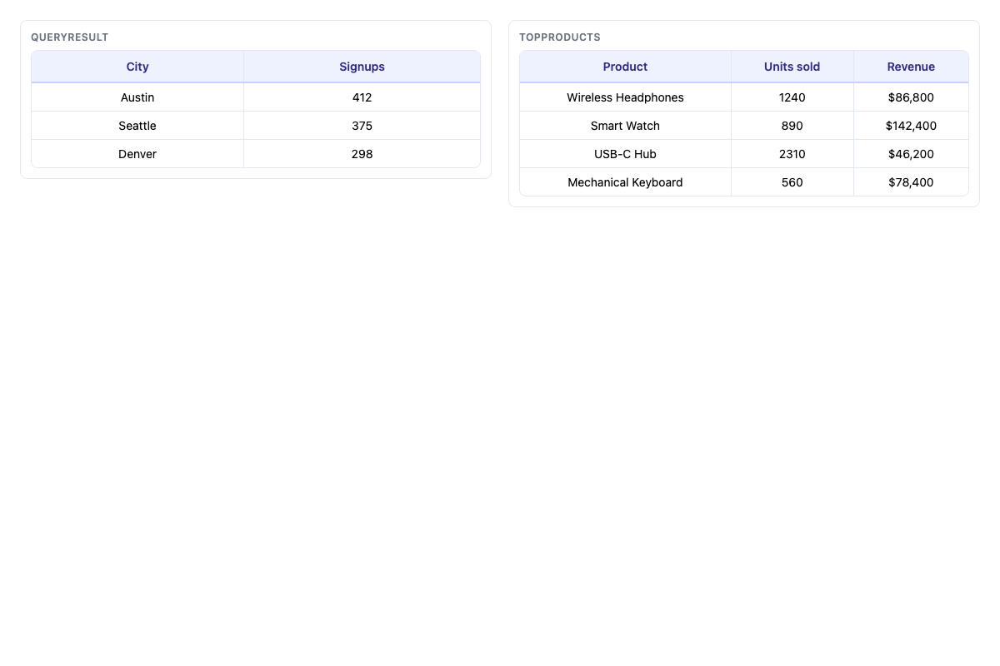
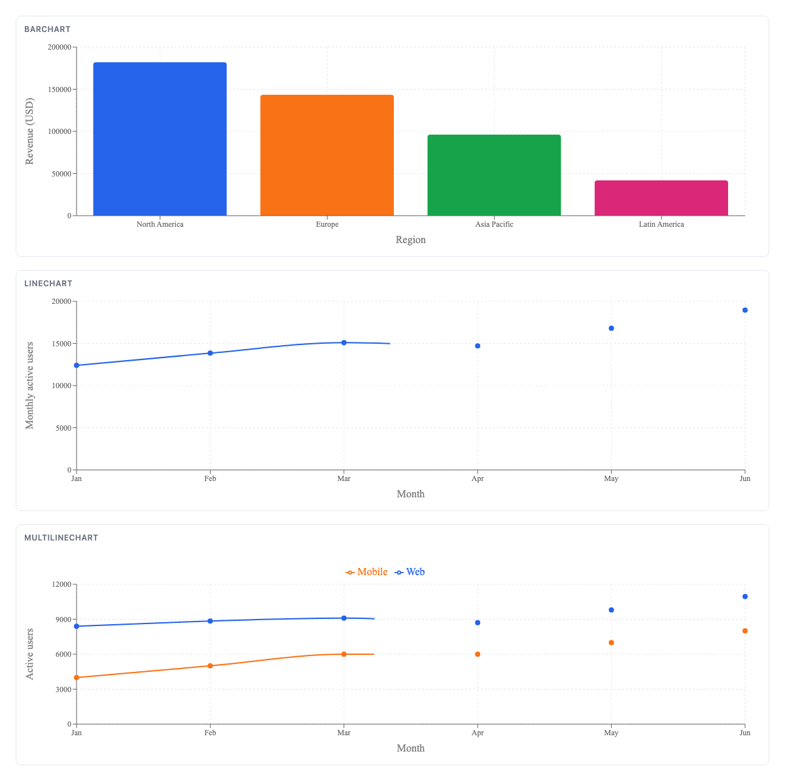

# dynamic-ui

Ask questions in plain English, get answers rendered as UI.

**dynamic-ui** is a data chatbot: a Python agent (Gemini, no Google ADK) answers
questions over live data exposed through an [MCP](https://modelcontextprotocol.io)
server, then renders each answer as real UI — tables, charts, cards — using the
[A2UI](https://a2ui.org) protocol. The browser talks to the agent over
[A2A](https://a2a-protocol.org/), and the official `@a2ui/react` renderer draws
the UI.

## Architecture

```
Browser (:3000) --chat--> Next.js --/api/agent--> A2A --> Python agent (:8000)
                                                              |
                                    MCP (Streamable-HTTP)     | Gemini tool-calling loop
                                                              v
                                                    Data server (:8001)
                                              describe_query + query_* tools
```

One question, one turn:

1. On startup the agent opens a persistent MCP session to `MCP_DATA_URL`,
   lists its tools, and converts each tool's JSON Schema into a Gemini
   `FunctionDeclaration`.
2. `answer()` runs a hand-rolled tool-calling loop — google-genai's automatic
   function calling deep-copies the request config, which crashes on a live
   MCP `ClientSession` (unpicklable `asyncio.Future`), so dispatch is manual.
3. The system prompt names exactly one discovery tool, `describe_query`; the
   model calls it to learn an entity's fields and filter grammar, then queries
   what it needs. All data tools are discovered dynamically.
4. The model emits its UI through a dedicated `send_a2ui_json_to_client` tool;
   the payload is validated against `backend/catalog/dynamic_ui_catalog.json`
   and returned as A2A `DataPart`s for `@a2ui/react` to render.

The only thing the agent assumes about the data service is the `describe_query`
discovery convention. Point `MCP_DATA_URL` at any compatible MCP server — the
bundled `mock-data/` server is a synthetic drop-in.

## Screenshots




## Quickstart

Three processes. First the data server (synthetic demo data — customers,
orders, products):

```bash
cd mock-data
uv sync
uv run server.py          # serves http://localhost:8001/mcp/
```

Then the agent backend (needs a Gemini API key):

```bash
cd backend
cp .env.example .env     # then set GEMINI_API_KEY
uv sync
uv run .                 # serves http://localhost:8000
```

Then the frontend:

```bash
cd frontend
npm install
npm run dev              # http://localhost:3000
```

Open http://localhost:3000 and ask things like:

- "Which orders are over $100?"
- "Show me customers from Austin."
- "Show me order 5 along with its customer."

## Configuration

`backend/.env`:

| Variable | Required | Default | Description |
|---|---|---|---|
| `GEMINI_API_KEY` | yes | — | Key from [Google AI Studio](https://aistudio.google.com/apikey) |
| `MCP_DATA_URL` | yes | — | Streamable-HTTP MCP endpoint, e.g. `http://localhost:8001/mcp/` |
| `GEMINI_MODEL` | no | `gemini-3-flash-preview` | Gemini model name |

## Using a real data service

Swap `MCP_DATA_URL` to any Streamable-HTTP MCP server exposing
`describe_query(entity)` plus `query_*` tools — the agent discovers them
dynamically, no code changes needed.

## Project layout

- `backend/` — Python A2A agent (Gemini + MCP + A2UI, no Google ADK)
- `frontend/` — Next.js chat UI rendering A2UI with `@a2ui/react`
- `mock-data/` — synthetic MCP data server (customers/orders/products) for local demos
- `ds-bundle/` — vendored design-system bundle + component screenshots
- `docs/` — design notes and implementation plans

## Tech stack

Python 3.12 · `uv` · `google-genai` · `mcp` (Streamable-HTTP) · `a2a-sdk` ·
`a2ui-agent-sdk` / `a2ui-core` · Next.js (App Router, TypeScript) ·
`@a2ui/react` + `@a2ui/web_core` (v0.9) · `@a2a-js/sdk` · `zod`
